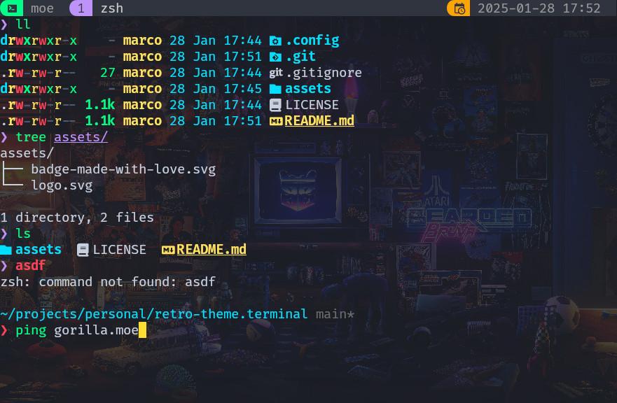

<div align="center">


# retro-theme.terminal

[](https://mistweaverco.com)
[](https://github.com/mistweaverco/kulala.nvim/releases/latest)

[Install](#install) • [Configuration](#configuration) 

<p></p>

A simple, yet beautiful kitty terminal theme.

<p></p>



<p></p>

</div>

## Install

```sh
git clone git@github.com:mistweaverco/retro-theme.terminal.git /tmp/retro-theme.terminal
mkdir -p $HOME/.config/kitty/themes/retro-theme
cp -pr /tmp/retro-theme.terminal/.config/kitty/* $HOME/.config/kitty/themes/retro-theme
```

## Configuration

Add this to your kitty config:

```
background_image $HOME/.config/kitty/themes/retro-theme/wallpaper-retro-4k.jpg
background_image_layout cscaled
background_tint 0.95

include themes/retro-theme/retro-theme.kitty.conf
```
